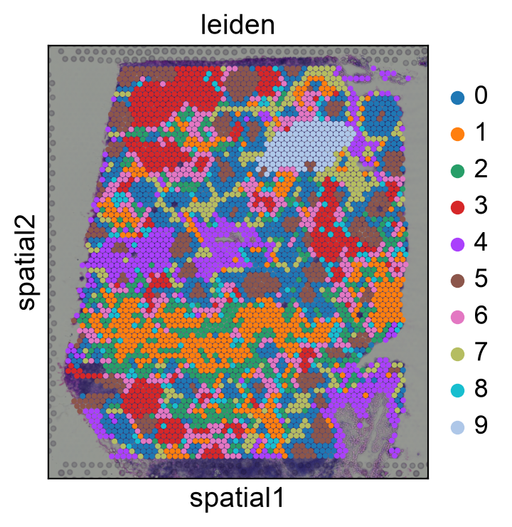
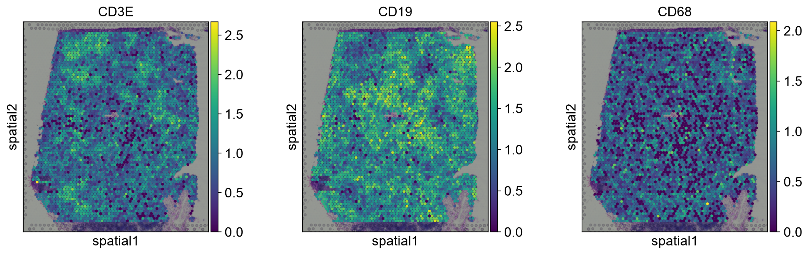
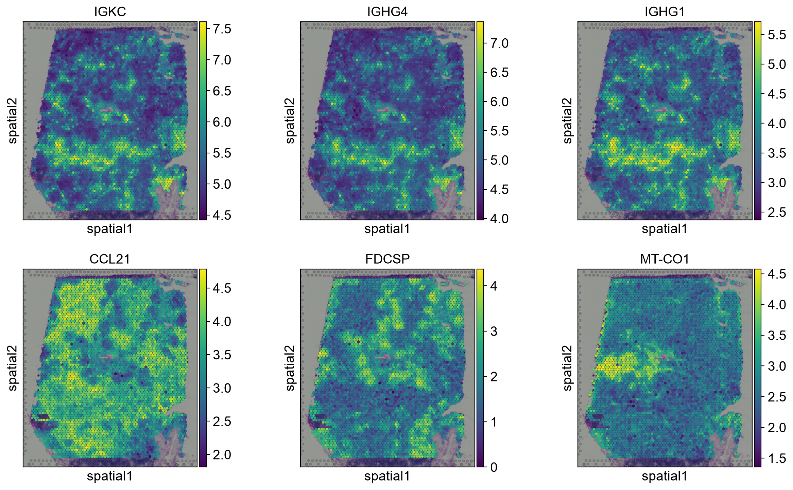

# Spatial Transcriptomics — Visium Lymph Node

## What is spatial transcriptomics / what is a Visium spot
Spatial transcriptomics allows us to understand RNA expression from cells in tissue with spatial context. While scRNA-seq data can give us expression information from transcripts per cell, we lack any context about where in tissue they lie. Knowing which part of tissue shows expression from which genes can help solve more complex biological problems, like knowing how a T-cell behaves near a tumor cell vs far from one. Spatial transcriptomics is analyzing the transcriptome while utilizing its spatial information in tissue. 

10x Visium spots are 55 um in diameter with a 100um center-to-center distance between them. They can capture between 1-10 cells on average, which depends on the tissue type and cell size. In this project, I investigate the expression of each spot although there could be multiple cells within each spot. These spots and their locations are analyzed as well, to extract spatial information to determine if there are marker genes that can expose structural information. 

## Dataset
- Source: squidpy built-in dataset, V1_Human_Lymph_Node (10x Genomics public data)
- 4035 spots × 36,601 genes (raw)

## QC
- Filtered spots below ~4000 total counts (identified via knee plot, not a default threshold) → 3995 spots retained
- Filtered genes detected in <3 spots
- Mitochondrial % was uniformly low (max 5.4%); no additional mito filtering applied

## Clustering
- Normalized (target_sum=1e4) + log1p, 2000 HVGs, PCA (50 components), Leiden (resolution=1.0) → 9 clusters

## Spatial findings
- Clusters form spatially coherent oval regions on tissue, not random speckling — suggests clusters correspond to real anatomical structures (e.g. germinal centers, T-cell zones)
- Marker genes (CD3E, CD19, CD68) show spatial enrichment aligned with cluster boundaries
- Moran's I spatial autocorrelation identified [top genes] as spatially variable — [overlap or not] with cluster-defining marker genes

## What this is / isn't
- Real QC/clustering/analysis on public data
- Does not include cell-type deconvolution (Tangram) or label transfer from the PBMC reference — noted as a future direction

## Figures

